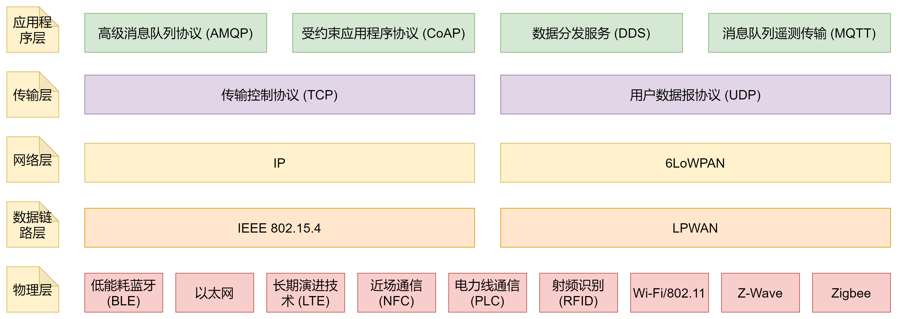
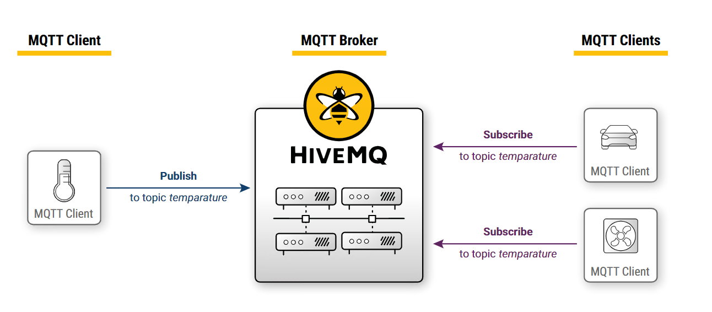

# 物联网协议――MQTT

### 物联网协议

[《IoT 技术和协议――IoT协议和连接》](https://azure.microsoft.com/zh-cn/solutions/iot/iot-technology-protocols/)，描述了物联网在不同数据层次的主流协议，如下图所示：

词汇解释：

| 层次       | 名词                      | 说明                                                                                                                                                     |
| ---------- | ------------------------- | -------------------------------------------------------------------------------------------------------------------------------------------------------- |
| 应用程序层 | 高级消息队列协议 (AMQP)   | 在消息中间件之间创建互操作性的软件层。它促进一系列系统和应用程序协同工作，从而创建行业规模的标准化消息。                                                 |
|            | 受约束应用程序协议 (CoAP) | 受约束带宽和受约束网络协议，专为设备到设备通信时连接功能受限的设备设计。CoAP 也是基于用户数据报协议 (UDP) 运行的文档传输协议。                           |
|            | 数据分发服务 (DDS)        | 一种通用对等通信协议，可实现从运行微型设备到连接高性能网络的所有操作。DDS 简化部署，提高可靠性并降低复杂性。                                             |
|            | 消息队列遥测传输 (MQTT)   | 一种消息协议，专为轻量级的设备到设备通信设计，主要用于与远程位置的低带宽连接。MQTT 使用“发布者-订阅者”模式，非常适合需要使用高效带宽和电池的小型设备。 |
| 传输层     | 传输控制协议 (TCP)        | 适用于大多数 Internet 连接的主要协议。它提供主机到主机的通信，将大量数据分成单独的数据包，并根据需要重新发送和重组数据包。                               |
|            | 用户数据报协议 (UDP)      | 一种通信协议，可实现进程到进程的通信，且基于 IP 运行。UDP 可提高基于 TCP 的数据传输速率，最适合需要无损数据传输的应用程序。                              |
| 网络层     | IP                        | 许多 IoT 协议使用 IPv4，而更近的执行使用 IPv6。IP 的这一最新更新可跨 Internet 路由流量，并识别和定位网络上的设备。                                       |
|            | 6LoWPAN                   | 此 IoT 协议最适用于处理能力有限的低功耗设备。                                                                                                            |
| 数据链路层 | IEEE 802.15.4             | 适用于低能耗无线连接的无线电标准。它与 Zigbee、6LoWPAN 和其他标准结合使用，用于构建无线嵌入式网络。                                                      |
|            | LPWAN                     | 低能耗广域网络 (LPWAN) 在某些位置可实现 500 米到 1 万多米的通信距离。LoRaWAN 是针对低能耗进行优化的 LPWAN 示例。                                         |
| 物理层     | 低能耗蓝牙 (BLE)          | BLE 可大幅降低能耗和成本，且与经典版蓝牙相比连接范围大致相同。BLE 可跨移动操作系统以本机方式运行，因成本低和电池寿命长，迅速成为了消费类电子产品首选。   |
|            | 以太网                    | 这种有线连接成本较低，可提供快速数据连接和低延迟。                                                                                                       |
|            | 长期演进技术 (LTE)        | 适用于移动设备和数据终端的无线宽带通信标准。LTE 提升了无线网络的容量和速度，且支持多播和广播流。                                                         |
|            | 近场通信 (NFC)            | 一组使用电磁场的通信协议，该协议允许两个设备在 4 厘米范围内相互通信。支持 NFC 的设备可用作身份钥匙卡，通常用于非接触移动支付、票务处理和智能卡。         |
|            | 电力线通信 (PLC)          | 一种通信技术，可通过现有电缆发送和接收数据。这使你可以通过同一电缆来实现和控制 IoT 设备。                                                                |
|            | 射频识别 (RFID)           | RFID 使用电磁场跟踪原本无功耗的电子标签。兼容硬件可以为这些标签供电，与其通信，读取其信息以进行识别和身份验证。                                          |
|            | Wi-Fi/802.11              | Wi-Fi/802.11 是家庭和公司的标准。尽管其成本低廉，但由于范围有限且全天候耗能，因此可能并不适合所有方案。                                                  |
|            | Z-Wave                    | 一种网状网络，使用低能耗无线电波在设备之间进行通信。                                                                                                     |
|            | Zigbee                    | 基于 IEEE 802.15.4 的规范，适用于一套高级通信协议，用于创建具有小型、低功耗数字无线电收发器的个人局域网络。                                              |

个人工作方向，主要关注应用程序层。因此，进一步对比应用层协议。此处参考[IOT（物联网）的七大通信协议](https://zhuanlan.zhihu.com/p/145690649)：

| 协议     | 特点                                                                                                                                                                                                      |
| -------- | --------------------------------------------------------------------------------------------------------------------------------------------------------------------------------------------------------- |
| CoAP协议 | 是简化了HTTP的RESTful API，基于6LowPAN，使用与资源受限的通信IP网络，特点： 1. 压缩报头； 2. 传输层使用UDP； 3. 支持异步通信； 4. 支持资源发现； 5. 支持缓存； 实现：libcoap |
| MQTT     | 适用于低带宽、不可靠网络，特点： 1. 基于发布/订阅消息模式； 2. 基于TCP/IP连接；                                                                                                                 |
| DDS      | 分布式高可靠性、实时传输数据通信： 1. 以数据为中心； 2. 使用无代理的发布/订阅模式，支持点对点、点对多、多对多；                                                                                 |
| AMQP     | 应用于金融系统的交易消息传递 实现：RabbitMQ                                                                                                                                                          |
| XMPP     | 适用于即时通信                                                                                                                                                                                            |
| JMS      | JAVA平台中著名的消息队列协议                                                                                                                                                                              |

见有人提到Modbus协议，查证资料[《MQTT和Modbus协议的区别》](https://zhuanlan.zhihu.com/p/231019131)了解：

Modbus是工业现场，网关和传感器之间的协议；

而MQTT，是网关和物联网平台之间的协议；

两者互为补充，构成物联网平台

## MQTT

MQTT，全称Message Queuing Telemetry Transport，消息队列遥测传输协议，是一种基于TCP/IP协议，轻量、二进制的发布/订阅协议。MQTT适用于硬件性能低、网络环境差等物联网场景。

协议特点：

协议包含如下角色：

| 角色   | 名称           | 功能                                                 |
| ------ | -------------- | ---------------------------------------------------- |
| Client | Publisher      | 向代理发布消息                                       |
| Client | Subscriber     | 向代理订阅消息                                       |
| Broken | Broker（代理） | 1. 接受发布者的发布消息； 2. 向订阅者发送消息； |

如下图所示，见[参考文献1]( "Chapter 2 - The Publish Subscribe Pattern")：

## 参考文献

[[1] MQTT &amp; MQTT 5 Essentials]()

[[2] IoT 技术和协议](https://azure.microsoft.com/zh-cn/solutions/iot/iot-technology-protocols/ "azure")

[[3] IOT（物联网）的七大通信协议](https://zhuanlan.zhihu.com/p/145690649)

[[4] 《MQTT和Modbus协议的区别》](https://zhuanlan.zhihu.com/p/231019131)
