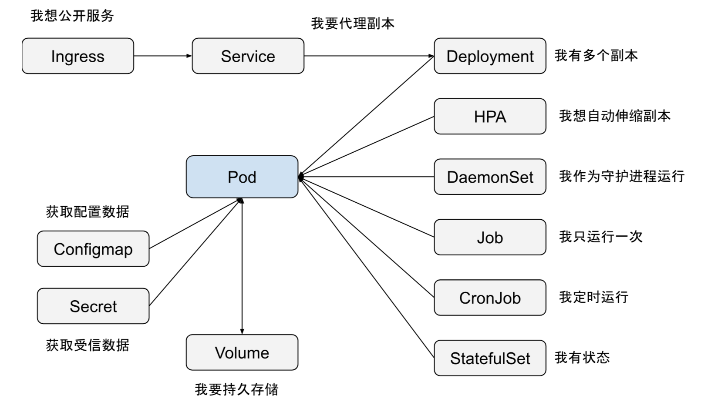

# K8S常用命令

## 概念



围绕pod的workload概念

| 概念        | 说明                                                |  |
| ----------- | --------------------------------------------------- | - |
| Deployment  | 用于管理无状态应用程序的Pods，支持滚动更新和扩缩容  |  |
| StatefulSet | 用于管理有状态应用程序，保证Pods的顺序和持久性      |  |
| DaemonSet   | 确保在每个节点上运行一个Pod，通常用于集群管理或监控 |  |
| ReplicaSet  | 用于确保指定数量的Pod副本在运行                     |  |
| Job/CronJob | 用于管理一次性任务或定期任务                        |  |
|             |                                                     |  |

## pod操作

```bash
# 进入tsdb-dproxy
kubectl exec -it ?$(kubectl get po | grep tsdb-dproxy | awk '{print $1}') -- bash

# 进入tsdb-service
kubectl exec -it tsdb-service-0 -c=tsdb-service -- bash

# 查看内存：
kubectl top pods | sort -k3 -hr

# k8s拉包&删包，自动启动：
docker pull registry.supos.ai/jenkins/tsdb-service:5.00.01.00-C-M6-T2 && kubectl delete po $(kubectl get po | grep tsdb-service | awk '{print $1}')
```

## 编辑启动参数

```bash
# 修改tsdb-service
kubectl edit sts tsdb-service

#修改tsdb-dproxy
kubectl edit deploy tsdb-dproxy

# 开放ip端口
kubectl edit svc tsdb-service-dt
#type中的ClusterIP，改成NodePort
```

## 查看日志

```bash
# 查看日志
kubectl logs -f $(kubectl get po | grep tsdb-api | awk '{print $1}')
kubectl logs tsdb-service-0 -c=tsdb-service

# 查看描述
kubectl describe pod my-pod 
kubectl describe pod tsdb-service-0
```

## 网络

```bash
# k8s 转发
kubectl port-forward tsdb-service-0 30000:17022 --address=0.0.0.0
# 直接使用socat转发。k8s无法访问socat时使用
socat TCP-LISTEN:local_port,fork TCP:kubernetes_node_ip:kubernetes_node_port
socat TCP-LISTEN:30000,fork TCP:$(kubectl  get pod -o wide | grep tsdb-service-0 | awk '{print $6}'):17022
curl -X GET "http://$(kubectl  get pod -o wide | grep tsdb-service-0 | awk '{print $6}'):17022/api/ps/cmd?dest=BsRtdService.BsRtdService&cmd=opr%20devinfo"
curl -X GET "http://$(kubectl  get pod -o wide | grep tsdb-service-0 | awk '{print $6}'):17022/api/ps/cmd?dest=BsRtdService.BsRtdService&cmd=tag%20dump%20t3:dhb_col_ae/ae"

#查看pod ip
kubectl get pods -o wide

#网络抓包：
nsenter -t $(docker inspect $(docker ps | grep tsdb-service-0 | grep -av pause | awk '{print $1}') | jq .[0].State.Pid) -n ngrep -x tcp and port 19592

# 查看消息：
kubectl get po -owide |grep tsdb-service | grep -av migrate| awk '{print $6}' | xargs -i http get http://{}:19592/service-api/rtdb/v2/database
```

## 冗余

```bash
# 通过停止redis，进行切主：
kubectl scale deploy middleware-redis --replicas=0

# 查看主从信息
cat /var/local/share/cluster/cluster-info.json
```

## 集群

```bash
# 获取主节点
http GET http://192.168.12.57:8848/nacos/v1/cs/configs group==DEFAULT_GROUP dataId==tsdb-service:default
curl  -X GET  "http://192.168.237.26:8848/nacos/v1/cs/configs?group=DEFAULT_GROUP&dataId=tsdb-service:default"


# 修改主节点
http PUT http://100.114.209.16:19599/inter-api/tsdb-service/deploy/api/v1/services/status X-Tenant-Id:dt id=tsdb-service-0
```

## docker本地推送

```bash
# 拉取包
docker pull registry.supos.ai/jenkins/tsdb-migrate-tools:5.00.01.00-C-R1-T2-ARM64

# 本地打tag
docker tag registry.supos.ai/jenkins/tsdb-migrate-tools:5.00.01.00-C-R1-T2-ARM64 registry:5000/jenkins/tsdb-migrate-tools:5.00.01.00-C-R1-T2

# 向本地推送
docker push registry:5000/jenkins/tsdb-migrate-tools:5.00.01.00-C-R1-T2

# 提交本地容器
docker commit your-container-id new-image-name
```
