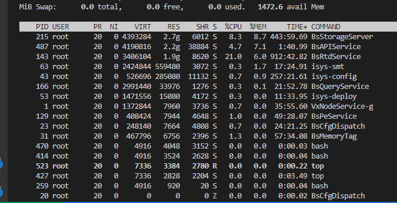

# 2023.04

TODO: 数据湖云原生评测：

1. 修改内存数据长度；
2. 剪切文件；

TODO: 存档转换工具；

TODO: 30W内存占用：API漏内存(2.2G)、历史数据内存优化、smt内存占用500M；

进程：

BsAPIService；

isys-deploy；

isys-smt；

BsMemoryTag；

VxNodeService；

BsCfgDispatch;

BsPeService；

BsRtdService

BsQueryService；

BsStorageServer；

isys-config；

TODO: 技术架构PPT

围绕时序数据入湖，提供采集器点位配置、数据上送到湖里走的协议（包括数据流），内部历史数据管理、接口开放等相关技术架构说明，即描述清楚现在我们是怎么做的；以及如何被K8S管理调度。

针对上述我描述的内容，想想从技术架构角度做几页相关PPT阐述下

~~TODO: 福建石化功能：~~

~~大跨度趋势速度；~~

~~ASPEN excel插件——操作工：~~

1. ~~读实时值；~~
2. ~~读历史值；~~
3. ~~打开报表，重新读取数据，导致比较慢；~~
4. ~~跨电脑，报表（函数）不可复用；~~
5. ~~可替换；~~

~~客户IT：~~

1. ~~提供VBS脚本，使用ODBC连接；~~
2. ~~读历史值、聚合数据；~~
3. ~~读实时值，无组态、无联表；~~
4. ~~可考虑替换或修改；~~

## 04.03~04.08

| 时间  | 事项                                                                  |
| ----- | --------------------------------------------------------------------- |
| 04.03 | 1. 国家管网对接； 2. bug修复； 3. 多租户RTA;                |
| 04.04 | 1. 多租户RTA; 2. BUG排查；                                      |
| 04.05 |                                                                       |
| 04.06 | 1. 国家管网预演示； 2. supOS Lite质量码对接； 3. bug修复； |
| 04.07 | 1. 内存问题排查； 2. bug修复； 3. 福建石化调研；            |
| 04.08 | 1. bug修复； 2. 多租户RTA；                                      |
| 04.09 |                                                                       |

## 04.10~04.15

| 时间  | 事项                                                                |
| ----- | ------------------------------------------------------------------- |
| 04.10 | 1. 多租户RTA评审； 2. 数据湖PPT架构； 3. supOS Lite修改； |
| 04.11 | 1. 巴陵石化沟通； 2. supOS Lite调整；                          |
| 04.12 | 1. 数据转换工具编码； 2. bug排查；                             |
| 04.13 | 1. 数据转换工具编码； 2. bug排查；                             |
| 04.14 | 1. 数据转换工具编码； 2. bug排查；                             |
| 04.15 |                                                                     |
| 04.16 |                                                                     |

## 04.17~04.22

| 时间  | 事项                                                                                               |
| ----- | -------------------------------------------------------------------------------------------------- |
| 04.17 | TODO: 合并OODM组态； 1. 存档合并工具； 2. 国际项目交流； 3. 数据湖bug修复；         |
| 04.18 | 1. 数据湖bug修复； 2. 存档合并工具； TODO: 客户交流                                      |
| 04.19 | 1. 数据湖bug排查； 2. 存档合并工具；                                                        |
| 04.20 | 1. 数据湖bug排查； 2. 存档合并工具； 3. 国家管网评测沟通；                             |
| 04.21 | 1. 数据湖bug会议； 2. 东南电化，查询bug排查； 3. 面试问题沟通； 4. 存档合并工具； |
| 04.22 |                                                                                                    |
| 04.23 |                                                                                                    |

## 04.23~04.28

| 时间  | 事项                                                 |
| ----- | ---------------------------------------------------- |
| 04.23 | 1. bug排查； 2. 数据转化工具linux编译；         |
| 04.24 | 1. 变革会议； 2. 数据转换工具pod调试；          |
| 04.25 | 1. bug排查； 2. VxBase&OODM组态合并，功能讨论； |
| 04.26 |                                                      |
| 04.27 |                                                      |
| 04.28 |                                                      |
| 04.29 |                                                      |
