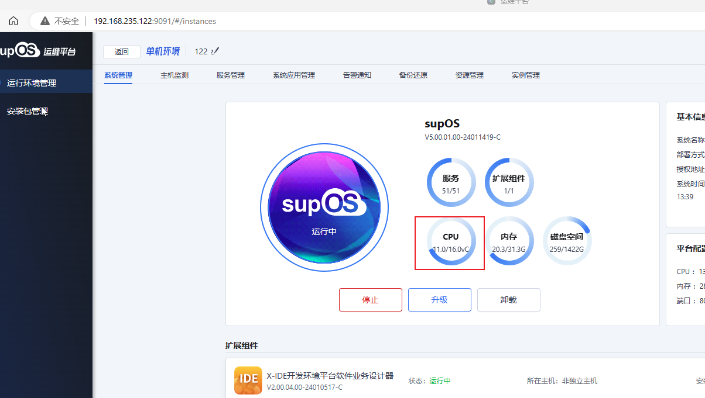
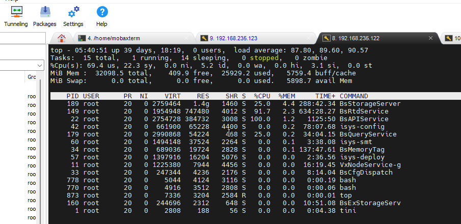
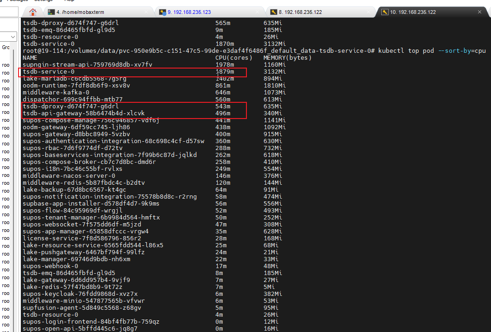

# 当前环境

192.168.235.122，目前16C环境，总计占用约11C

VxBase环境，目前总计消耗约3C
tsdb-service: 2C。tsdb-service内部，API服务约0.8C、实时服务约0.8C、历史和其他服务，约0.3C

tsdb-dproxy: 0.5C

tsdb-api-gateway: 0.5C

cpu问题点：

1. 实时数据订阅链路：实时服务 -> API服务 -> 推送kafka。全量订阅了数据，消耗CUP约0.8c;
   优化点：通过接入服务或实时服务，直接全量送数据至kafka。可节约1C；
2. 写值链路：API服务 -> 实时服务 -> 虚位号服务 -> 实时服务。高频写值，消耗CPU约0.8c;
   优化点：写值不通过api，直接写入实时或虚位号服务。大约可节约0.5C；

上述优化后，约可优化1.5C的cpu，优化50%
